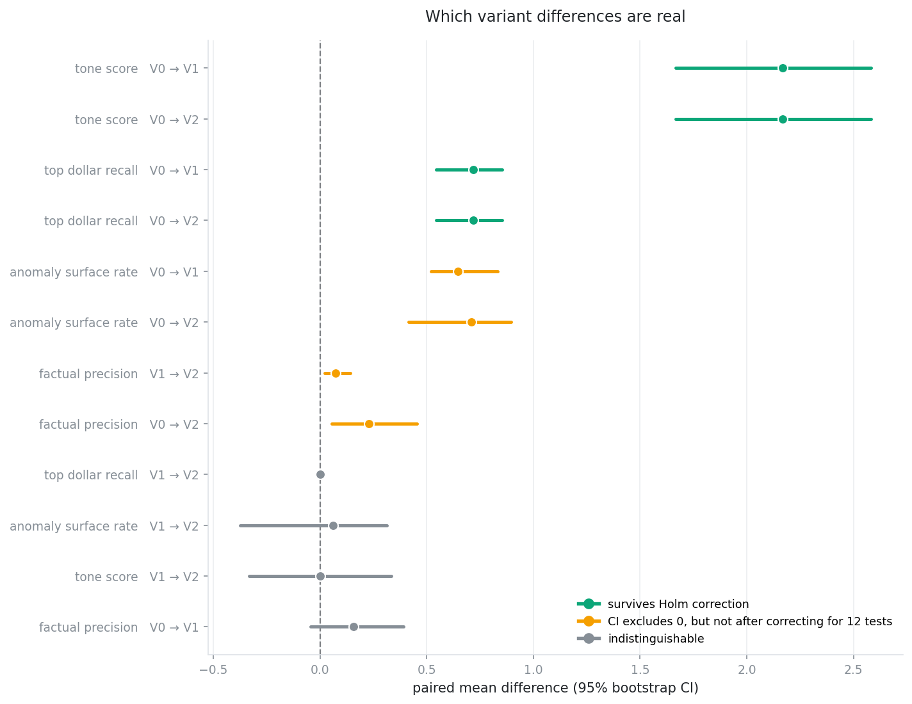
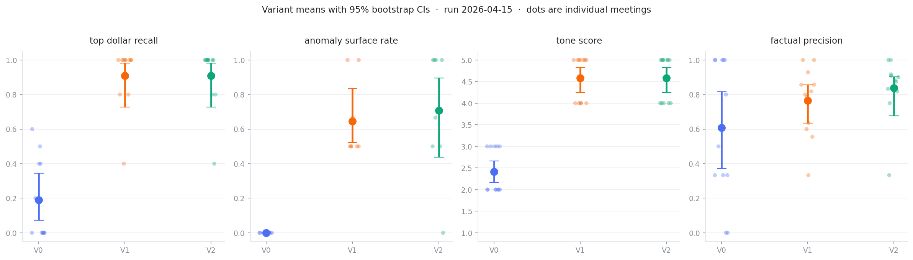
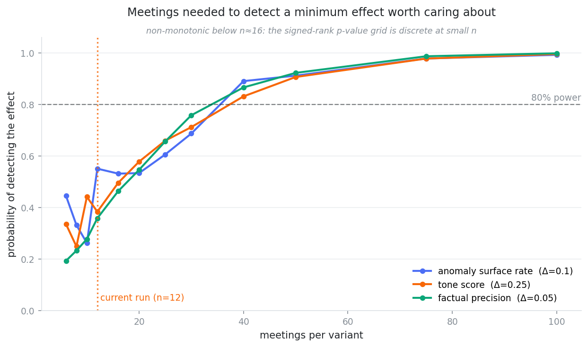

# compton-eval-analysis

A statistical layer for LLM eval runs. It answers one question: which of these differences are real?

Prompt evaluation harnesses tend to end at a table of means. Variant A scored 0.76, variant B scored 0.84, ship B. At the sample sizes anyone actually runs, a dozen items or maybe two dozen, that table cannot support the decision being made on it.

This package reads the output of an existing eval harness and adds the part that licenses a conclusion: interval estimates, paired significance tests, correction for running many tests at once, a reliability check on the LLM judge, and a power analysis that says how many items the next run needs.

Built against the summarization eval for [We the Compton](https://wethecompton.com), a civic intelligence platform. Everything below comes from a real run, not a demo fixture.

```bash
pip install -e .
compton-eval analyze path/to/run --out report/
```

## What it found

The harness compares three prompt variants across twelve council meetings on four dimensions. Read as means, V1 and V2 both look like large wins over V0, and V2 looks like a modest further gain over V1.

Twelve comparisons, Holm-corrected. Four survive.



V0 to V1 is a large improvement and it holds up. Tone gains 2.17 points on a 1–5 scale, top-dollar recall gains 0.72, and both survive correction comfortably. That prompt change worked.

V1 to V2 is a different story. Top-dollar recall is *identical on every single meeting*, not close but identical. Tone, identical. Anomaly surfacing differs by 0.06 with an interval running from −0.38 to +0.31. If V2 costs more tokens than V1, it is buying nothing I can measure.

One result sits right on the line, and the distinction is the whole reason this package exists. Factual precision from V1 to V2 comes to +0.073, bootstrap interval [+0.023, +0.142], excluding zero. Read alone, that is a win. Corrected for the twelve tests in the family, p climbs to 0.22. Four dimensions times three variant pairs means you should expect roughly one spurious "significant" result per run from chance alone, and this one is not distinguishable from that.

So the chart encodes three states rather than two. "The interval excludes zero" and "this survives multiplicity correction" are different claims, and this run contains rows where they disagree.

### The intervals are wide, and that is the finding



Every dot is one meeting. At n=12 the individual observations belong on the chart, because an aggregate mark hides the case where a single meeting is carrying the entire delta.

### How many meetings would be enough



Simulated from the observed noise distribution, against effects small enough to matter: 0.05 on factual precision, 0.10 on the bounded rates, 0.25 on the tone scale.

| Dimension | Minimum effect | Power at n=12 | Meetings for 80% |
|---|---|---|---|
| anomaly_surface_rate | 0.10 | 55% | 40 |
| tone_score | 0.25 | 38% | 40 |
| factual_precision | 0.05 | 36% | 40 |

A run of twelve meetings has roughly a one-in-three chance of noticing a regression. Nothing in the means table hinted at that.

### The judge has never been checked

```
reliability unavailable: no repeated judgments in this run. Every
(meeting, variant) was scored once. Re-run the tone judge k>=3 times over
the same manifest, tagging each pass, then re-run this check.
```

Tone is scored by an LLM against fixed calibration anchors. Anchoring pins the *scale*. It does not establish that the judge returns the same answer twice. Until the judge is scored repeatedly, every tone comparison above rests on an unverified instrument, and no sample size fixes that.

So the module refuses to compute a coefficient from single-pass data. Returning one anyway would be worse than returning nothing.

## Method

Five decisions, each of which changes the answer.

Tests are paired, not independent. Every variant is scored on the same meetings, which makes this a within-subjects design. Analysing it as two independent groups throws away the pairing along with most of the power the design was built to provide.

Wilcoxon signed-rank rather than a paired t-test. Three dimensions are proportions on [0, 1], and the fourth is an ordinal 1–5 judgment with heavy ties and a floor: V0 scores exactly 0.000 on anomaly surfacing for every meeting. Normality is not on offer at n=12.

BCa bootstrap intervals rather than normal-theory ones, because a t-interval on a proportion near its ceiling will hand back an upper bound above 1.0 for a quantity that cannot exceed 1.0. The bias-corrected and accelerated bootstrap handles both the skew and the median bias. Constant vectors return a degenerate interval instead of a NaN from a zero-variance acceleration term.

Cliff's delta rather than Cohen's d. Cohen's d divides a mean difference by a standard deviation, which presumes an interval scale. Cliff's delta asks something ordinal data can actually answer: draw one meeting under each variant, how much more often does one win?

Holm-Bonferroni across the whole family. Four dimensions times three pairs is twelve tests, and Holm controls family-wise error without Bonferroni's conservatism.

Two things are deliberately absent.

There is no post-hoc power calculation. Power computed from an observed effect is a monotone transform of the p-value; it tells you nothing new while sounding like it does. Power here is prospective only: given an effect you would want to detect, how many meetings.

There is no imputation of incomplete pairs. Meetings missing a variant get dropped and the count is reported (`anomaly_surface_rate` has 8 complete pairs of 12). Filling them in would manufacture precision.

## Three design notes

Ground truth lives in predicates, not IDs. Inherited from the upstream harness and repeated here because it is the detail people get wrong: the RAG test set stores relevance as SQL predicates rather than chunk IDs, since chunk IDs change on every re-chunk while "the chunks belonging to this agenda item" survives re-ingestion.

The power simulation pins `method="asymptotic"`. scipy's `wilcoxon` auto-selects the exact signed-rank distribution at small n and the normal approximation above it. Left on auto, that switch puts a discontinuity in the middle of the power curve, which is exactly the region being read. Pinning one method keeps the curve comparable across sample sizes, at the cost of being mildly conservative below n≈20. It also runs about four orders of magnitude faster, since the exact path does not vectorise over the simulation axis.

The curves go non-monotonic below n≈16, and that is real rather than simulation noise. The signed-rank statistic is discrete, so its attainable p-value grid is coarse at small n, and adding one item can move the critical threshold the wrong way. The chart labels this instead of smoothing it away.

## Layout

```
src/compton_eval/
  load.py         tidy loader; verifies the design is actually paired
  bootstrap.py    BCa intervals, paired and unpaired
  compare.py      signed-rank, Cliff's delta, Holm correction
  power.py        simulation-based prospective power
  reliability.py  ICC(2,1) and Krippendorff's alpha for judge agreement
  plots.py        forest, interval, and power charts
  cli.py          `compton-eval analyze`
tests/            23 tests, property-based rather than golden-number
examples/report/  output from the run described above
```

Requires Python 3.11+, numpy, pandas, scipy, matplotlib.

```bash
pip install -e ".[dev]"
pytest
```

## Using it on your own harness

The loader expects a `scores.json` shaped like this:

```json
{
  "run_id": "2026-04-15T23-05-34-891Z",
  "scores": [
    {"meeting_id": 1, "variant": "v0", "top_dollar_recall": 0.4, "tone_score": 2}
  ]
}
```

Rename `meeting_id` to whatever your items are, then adjust `DIMENSIONS` in `load.py` with each metric's scale. Everything downstream is generic. Nothing in it is specific to civic data or to summarization.

To make the reliability check work, score each item `k >= 3` times and tag the passes in a `pass` column.

Built by [O.M. Miles](https://github.com/ommiles). QA Automation Engineer, M.S. Analytics candidate at Georgia Tech. MIT licensed.
